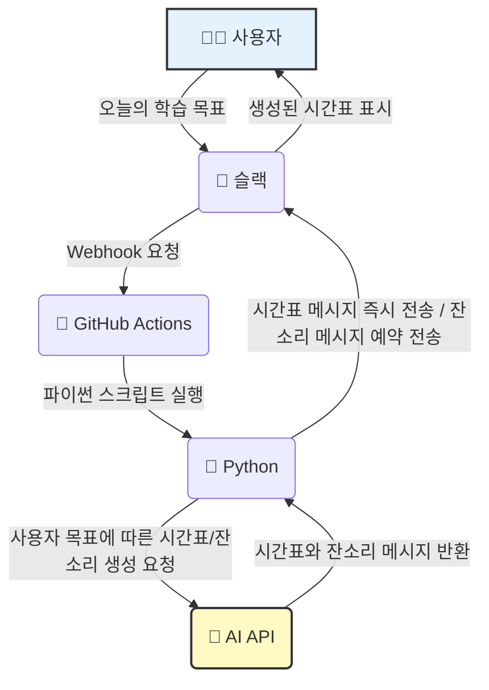
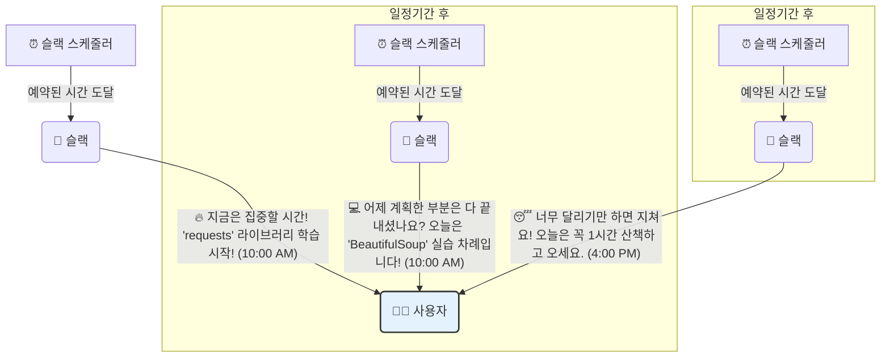

# relay-note33

## 릴레이 프로젝트를 하는 이유❗️
**1. AI라는 기술을 이해하고, 도움이 되는 방향으로 활용합니다.**  
- 지피지기면 백전백승이라는 말처럼, AI를 잘 활용하기 위해서는 AI에 대해 잘 알아야 합니다.
- 릴레이 프로젝트를 통해 “일단 많이 써 보면서” AI에 대해 알아가 보기를 바랍니다.

**2. 미션 요구사항 설계나 코드 작성이 아닌 [커뮤니티]와 [학습과 성장]에도 AI를 활용해 봅니다.**  
- 미션에서 벗어나 자유롭게 무엇이든 시도하며 한숨 돌리는 시간입니다.  
- 릴레이 프로젝트에서는 무엇이든 시도해 봐도 좋으니 잘하려고 하기보다는 재밌게 즐겨 보세요!  

<br>

# 🎯 해결하려는 문제
## ✅ 배경
챌린지 기간 동안 **학습과 구현, 성장과 휴식의 균형을 맞추기 어려워요.**  

<br>

## ✅ 목표
AI의 도움을 받아 **AI가 제시하는 시간표와 잔소리로 목표를 달성하고 싶어요.**  
- 학습과 구현의 성장 밸런스를 맞추기 위해 잔소리 봇과 생활 시간표를 활용해요.
- 잔소리 봇과 생활 시간표를 통해 정해진 시간까지만 학습과 구현을 진행해요.

<br>

### **흐름 예시**



<br>



예시에서는 워크플로는 `Github Actions`, 스크립트로는 `Python`, 알림은 `Slack`을 사용했어요.  
주어진 문제를 해결할 수 있다면 **어떠한 다른 방법과 도구를 사용해도 괜찮아요.**   

<br>

## 1. AI로 챌린지 생활 시간표 만들기 📅

목표를 입력하면 시간표를 짜주는 AI 프롬프트를 작성해보고, 결과를 레포지토리에 올려주세요.

### 🚀 달성기준

- [ ]  시간표를 적절한 형식으로 출력해야 해요. 이미지, 텍스트, 표 형식 등 알아볼 수 있는 형태면 돼요.
- [ ]  하루 또는 일주일간 이 시간표로 미션을 해결해보아요.
- [ ]  학습과 구현의 밸런스를 보장하는 시간표여야 해요.

**프롬프팅 예시**
```bash
// 오늘의 계획 작성.. 
`방학 생활 시간표 만들어줘 이미지로 귀엽게 동그란 형식 알지?`
```

**프롬프팅 결과**  

<div align=center>

</div>


<br>

## 2. 시간표 이벤트마다 알림보낼 수 있는 방법 조사하기 🔔

캠퍼들이 학습이나 구현의 밸런스를 맞출 수 있도록, 정해진 시간이 되면 잔소리를 보낼 수 있는 방법을 조사해주세요.

### **🚀 달성기준**

- [ ]  캠퍼들에게 잔소리를 해주는 AI 프롬프팅을 작성해봐요.
- [ ]  시간표 이벤트마다 알림보낼 수 있는 방법 조사해요. 어렵게 느껴진다면 **[`week1.md`](./week1.md)를 참고**해주세요.  
    - ex) `n8n`, `GitHub Actions`, `쉘 스크립트`, `crontab` 등을 사용하는 방법이 있어요.
- [ ]  조사 후 웹훅으로 슬랙 연동해보아요.(선택)

<br>

## 3. 잔소리 봇에 컨셉 부여하기 👯

잔소리를 해주는 프롬프팅을 만들 때 컨셉을 추가 해주세요.

### **🚀 달성기준**

- [ ]  잔소리 봇의 말투 옵션을 선택할 수 있어야 해요.
- [ ]  어떤 말투 옵션이 좋을지도 생각해보아요.
    - (예 : 엄마, 남자친구)
    - 남자친구/여자친구) 자기야.  아직도 학습 중이야? 오늘은 나랑 언제 전화할 수 있어 ? 😞
- [ ]  AI 응답이 선택한 말투를 잘 사용하는지 테스트 후 결과를 캡처해요.
- [ ]  조사 후 웹훅으로 슬랙 연동해보아요.(선택)

<br>

## 4. AI가 짜준 시간표 / 잔소리 대로 살아보기 🤓

AI가 짜준 시간표가 내 성장에 도움이 되는지 테스트해주세요.

1~3의 퀘스트를 수행 수 하루 이상 계획대로 보내보아요.

### **🚀 달성기준**

- [ ]  적어도 한번 AI가 짜준 시간표를 수행해보며 리뷰를 기록해요..
- [ ]  1~3의 퀘스트 중 한 가지를 골라 그 시간표/잔소리 대로 챌린지 하루를 보내요.
- [ ]  느낀점을 레포지토리에 작성해주세요.
