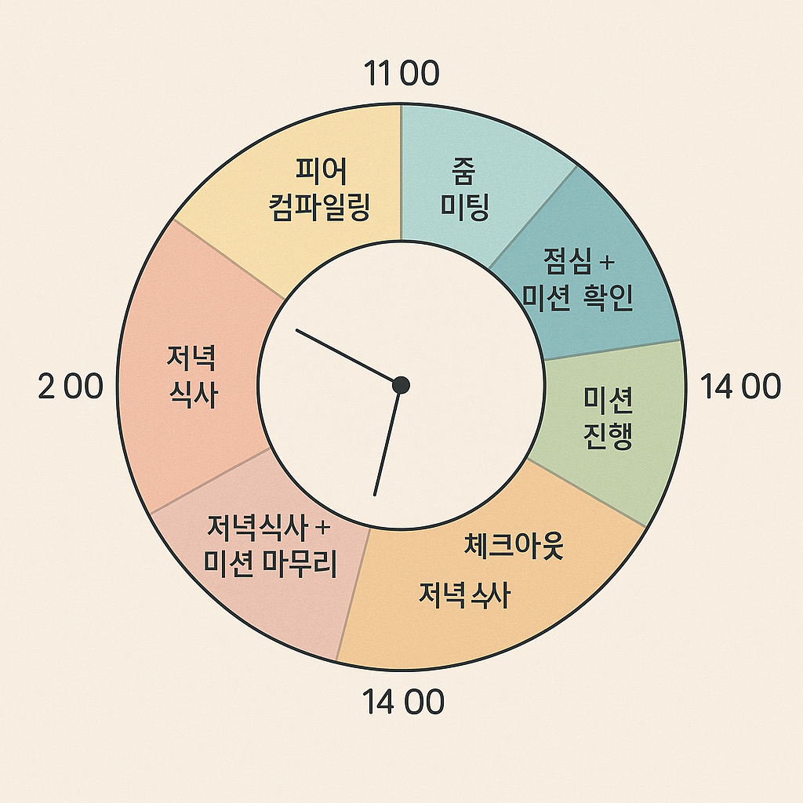

# J192 Week1 수행 내용

평일 미션의 여파로 릴레이 프로젝트를 제대로 구현하지 못하였음

## 퀘스트 1
✅ 오늘의 일정 리마인더
시간	할 일
10:00~11:00	피어 컴파일링
11:00~12:00	줌 미팅
12:00~14:00	점심 + 미션 확인
14:00	리드미 + 학습포인트 제출
14:00~19:00	미션 진행
19:00	체크아웃
19:00~저녁	저녁식사 + 미션 마무리
02:00	취침

🔔 시간대별 알림 (잔소리 포함 💣)
09:55 – “컴파일링 시작 5분 전! 얼른 준비하고 상대방 코드 살펴볼 준비해! 집중해보자 👀”

10:50 – “이제 슬슬 마무리하고 줌 미팅 준비하자. 피어에게도 수고했다는 말 한 마디 잊지 말기!”

11:00 – “줌 들어갔지? 안 들어가면 큰일 나~ 집중 모드 ON! 💻”

12:00 – “점심 먹으러 가자! 배 채우고, 가볍게 산책도 해주면 뇌가 더 잘 돌아가. 1시 30분쯤엔 슬슬 자리로 돌아와서 미션 확인하자~”

13:55 – “2시 리드미 제출 시간! 대충 넘기지 말고, 학습 포인트도 네가 오늘 성장한 증거니까 정성껏 써줘! ⌛”

14:00~15:30 – “이제 본격 미션 타임이야. 집중하고, 구글링보다 먼저 ‘생각’! 그리고 정리하면서 해!”

16:30 – “집중이 흐트러질 수 있는 시간! 10분 쉬었다 오든가, 스트레칭 좀 하자. 눈은 화면에서 떼고! 🧘”

18:30 – “마무리 정리 들어가자. 7시에 체크아웃이니까 결과나 진행 상황 깔끔하게 적어두기!”

19:00 – “체크아웃 완료! 잘했어! 👏 이젠 저녁 챙겨 먹자~ 밥은 먹어야 힘도 나지 🍱”

20:00~22:00 – “남은 미션 마무리하자. 집중 유지해서 11시 전엔 끝내는 걸 목표로 해보자!”

23:00 – “이쯤이면 거의 다 했지? 아직 안 끝났다면 1시간만 집중하자. 2시는 취침 목표야. 눈치챘지?”

01:30 – “30분 남았다. 정리하고, 무조건 잠들 준비! 밤샘은 절대 안 돼 ❌”

02:00 – “취침! 오늘 하루 고생 많았어. 눈 감고, 스마트폰 내려놓고, 내일도 힘내자 😴”

`텍스트는 추출이 잘 되었으나 다이어그램 이미지는 출력이 잘 되지 않음`

-> 한국어 이미지가 제대로 생성되지 않았음

-> 시간대가 잘못 형성되었음

-> 다시 프롬프트에 시간대와 태스크를 잘 매칭시켜달라고 하였으나, 여전히 처리하지 못함

## 퀘스트 2
<엄마표 잔소리>

알겠어~ 우리 아들(딸) 오늘 하루 잘 보내야지? 엄마가 시간 맞춰서 하나하나 알려줄게. 대충 하지 말고, 알람 울릴 땐 바로바로 움직여야 해! 🙃

👩‍👦‍👦 엄마표 잔소리 알림표
시간	엄마 잔소리 💬
09:55	“컴파일링 시작 5분 전이야~ 얼른 자리 정리하고, 물 한 컵 마셔! 아직 정신 못 차렸으면 눈 좀 씻고 와~”
10:50	“이제 마무리해야지~ 상대방한테도 ‘수고했어요’ 인사 꼭 하고, 줌 들어갈 준비해. 멍하니 있지 말고!”
11:00	“줌 들어갔지? 화면 껐으면 안 돼~ 말 또박또박 하고, 졸지 마! 집중하자~”
12:00	“밥 안 먹고 미션 한다고 하지 마~ 밥부터 먹어야 머리가 돌아가지. 천천히 꼭꼭 씹어 먹고, 눈도 좀 쉬고 와~”
13:30	“이제 슬슬 자리로 와야지~ 미션 확인하고, 리드미도 정리해. 마지막에 허겁지겁하지 말고 지금 해!”
13:55	“이제 곧 제출 시간이야~ 얼른 저장하고 업로드하고, 빠뜨린 거 없는지 다시 확인해. 엄마가 몇 번을 말하니~”
14:00	“자, 이제 본격적으로 미션 집중! 딴짓하지 말고 핸드폰은 뒤로 밀어놔! 엄마는 너가 할 수 있을 거라 믿는다~”
16:00	“좀 일어나서 스트레칭 좀 해~ 어깨 뭉쳤지? 화면만 보지 말고 창문 좀 열고 바람도 쐬고 와. 리프레시가 중요해~”
18:30	“이제 정리해~ 체크아웃 시간 다가오니까 메모랑 결과물 싹 정리하고, 놓친 거 없는지 꼭 확인하고!”
19:00	“수고했어~ 저녁 먹자! 밥 먹으면서는 컴퓨터 좀 꺼. 쉬는 것도 공부야~”
21:30	“미션 마무리는 지금 해두는 거야~ 늦게까지 질질 끌지 말고 11시 전에는 끝내도록 하자~”
01:30	“이제 마무리해~ 졸릴 때까지 하다보면 더 피곤해져. 지금이라도 씻고 잘 준비하자. 엄마는 늦게 자는 거 제일 싫어해~”
02:00	“안 자고 뭐 해? 얼른 자!!! 내일 피곤하다고 징징댈 거잖아~ 이불 덮고, 핸드폰 내려놓고, 코 자~ 😤”
